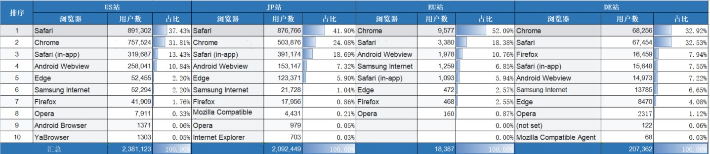
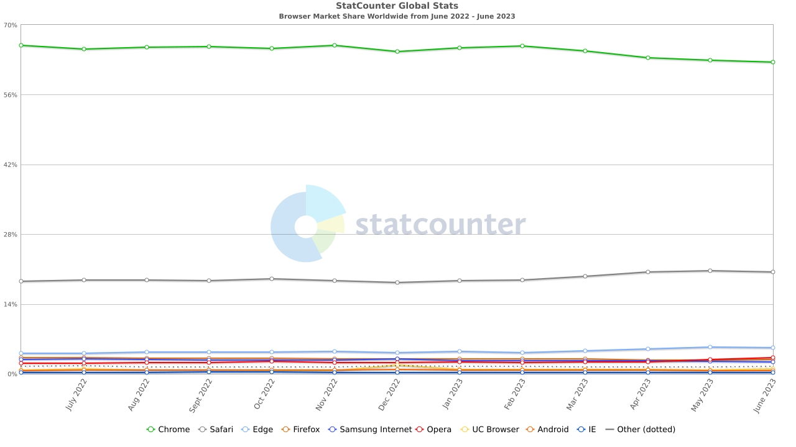
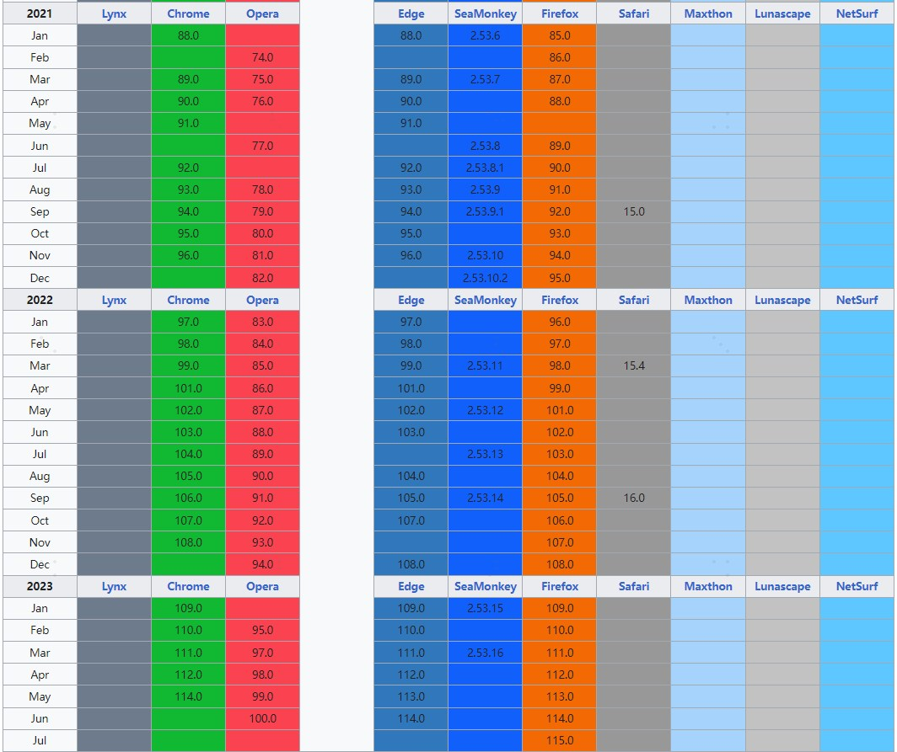

# 兼容性规范

## 定义兼容级别
- 完全兼容： 保证百分百功能正常
- 部分兼容: 只能保证功能、样式与需求大致一致。对于一些不影响主体需求和功能的bug，会做降低优先级处理或者不处理。
- 不兼容: 不考虑兼容性

## 兼容策略
**完全兼容:**
- Safari 15+
- Chrome 88+
- Edge 88+
- FireFox 85+
- Opera 74+

即 2021年及其之后发布的版本

**不兼容:** IE11及以下

**备注：**
- 版本号定义: 比如Chrome88+, 表示88及其以上版本
- 国内浏览器暂未加入到此兼容清单，后续扩展。

## 数据支撑
官网主要站点 近3个月（2023.04.14-2023.07.12）各浏览器访问占比GA数据

## 参考
- [statcounter](https://gs.statcounter.com/): 国际浏览器统计

- [浏览器发布年份统计](https://en.wikipedia.org/wiki/Timeline_of_web_browsers)
