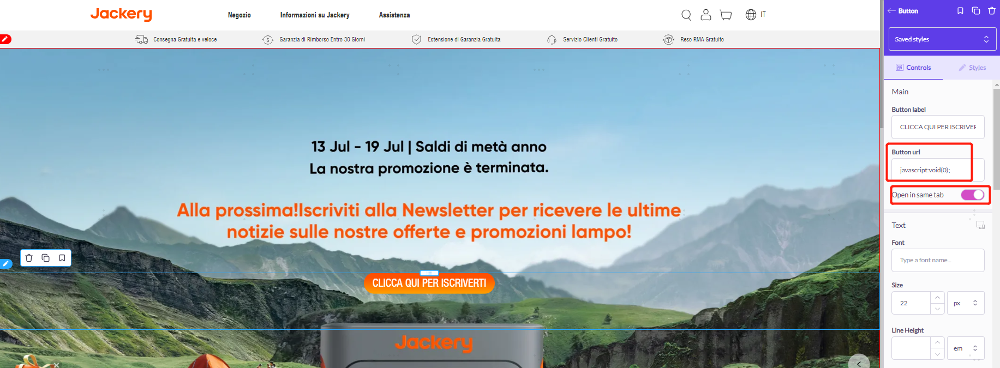

# 调用拉新弹窗


### 一、3.0调用拉新弹窗

> 站点： US、CA、UK、DE、EU

1、在当前元素因增一个`class`类： `M-newCustomer-button`,同时设置按钮不让跳转

- 设置`class`类


- 设置按钮不让跳转



2、使用`HTML`模板,并編入以下代码

```html
<script>
  // 防止打开一个新的空白页面
 // 调用拉新弹框
  $('.M-newCustomer-button').on('click', 'a', function(e) {
    e.preventDefault()
    new customerPlugin().iconClick()
  })
</script>
```


### 二、2.0调用拉新弹窗

> 站点：AU、IT、FR、ES、JP

1、在当前元素因增一个`class`类： `M-newCustomer-button`,同时设置按钮不让跳转

- 设置`class`类


- 设置按钮不让跳转


2、使用`HTML`模板,并編入以下代码


```html
<script>
  // 调用拉新弹框
  $('.M-newCustomer-button').on('click', 'a', function(e) {
    e.preventDefault()
    window.customerPlugin()
  })
</script>
```
### 三、备注

因`Shopify`3.0和2.0具有区别，因此代码层写的方法不同，所以在调用的时候代码也是不同的。

